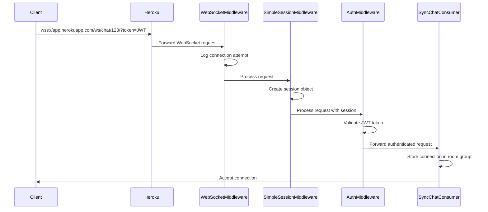

# Backend Structure Documentation

## Authentication System

### User Types
1. **Technician**
   - Professional service provider
   - Has portfolio images
   - Has skill sets
   - Has rate and reviews
   - Has wallet for payments
   - Has gender and date of birth (must be at least 18 years old)
   - Has years of expertise in their field

2. **Client**
   - Service requester
   - Can create contracts
   - Can review technicians
   - Has wallet for payments
   - Has gender and date of birth (must be at least 18 years old)

3. **Administrator**
   - Platform manager with elevated privileges
   - Has specific role (system_admin, content_moderator, account_manager, finance_admin)
   - Access to administrative functions
   - Manages user accounts and content

### Authentication Flow

1. **Registration Process**
   ```mermaid
   sequenceDiagram
      participant User
      participant Frontend
      participant Backend
      participant Email
      
      User->>Frontend: Fill registration form (with gender and DOB)
      Frontend->>Backend: GET /api/generate-captcha/
      Backend-->>Frontend: Return CAPTCHA
      User->>Frontend: Complete CAPTCHA
      Frontend->>Frontend: Validate age (18+)
      Frontend->>Backend: POST /api/register/
      Backend->>Backend: Validate required fields
      Backend-->>Frontend: Create inactive user
      Backend->>Email: Send OTP to user's email
      Email-->>User: Receive OTP
      User->>Frontend: Enter OTP
      Frontend->>Backend: POST /api/verify-otp/
      Backend-->>Frontend: Activate user
      
      alt OTP Expired or Not Received
        User->>Frontend: Request new OTP
        Frontend->>Backend: POST /api/resend-otp/
        Backend->>Email: Send new OTP to user's email
        Email-->>User: Receive new OTP
        User->>Frontend: Enter new OTP
        Frontend->>Backend: POST /api/verify-otp/
        Backend-->>Frontend: Activate user
      end
   ```

2. **Login Process**
   ```mermaid
   sequenceDiagram
      participant User
      participant Frontend
      participant Backend
      
      User->>Frontend: Enter credentials
      Frontend->>Backend: POST /api/login/
      Backend-->>Frontend: Return JWT tokens
      Frontend->>Backend: GET /api/user-info/
      Backend-->>Frontend: Return user profile
   ```

3. **Password Reset Flow**
   ```mermaid
   sequenceDiagram
      participant User
      participant Frontend
      participant Backend
      participant Email
      
      User->>Frontend: Request password reset
      Frontend->>Backend: POST /api/password-reset/
      Backend-->>Frontend: Validate email
      Backend->>Email: Send OTP to user's email
      Email-->>User: Receive OTP
      User->>Frontend: Enter OTP & new password
      Frontend->>Backend: POST /api/password-reset-confirm/
      Backend-->>Frontend: Reset password
   ```

## API Endpoints Structure

### Authentication Endpoints
1. **CAPTCHA**
   - `GET /api/generate-captcha/`
   - No authentication required
   - Returns CAPTCHA key and image URL

2. **Registration**
   - `POST /api/register/`
   - Requires CAPTCHA
   - Requires gender and date of birth (18+ age validation)
   - Creates inactive user account
   - Returns user details and verification_id for OTP verification

3. **OTP Verification**
   - `POST /api/verify-otp/`
   - Verifies email address
   - Requires verification_id from registration response
   - Activates user account

4. **Resend OTP**
   - `POST /api/resend-otp/`
   - Resends OTP to email
   - Returns new verification_id
   - For activation or password reset

5. **Login**
   - `POST /api/login/`
   - Returns JWT token pair and user information
   - Profile info included in response
   - Required for protected endpoints

6. **Token Refresh**
   - `POST /api/login/refresh/`
   - Refreshes access token

7. **Logout**
   - `POST /api/logout/`
   - Blacklists refresh token

### User Management Endpoints

1. **Password Reset**
   - `POST /api/password-reset/`
   - Initiates reset process
   - `POST /api/password-reset-confirm/`
   - Completes reset process

### Profile Management

1. **Technician Profiles**
   - `GET /api/technicians/`
   - List all technicians
   - `GET/PUT /api/technician/<uuid:pk>/`
   - Individual profile operations
   - Public views hide sensitive information (date of birth, age, phone number, address)
   - Gender is publicly visible

2. **Client Profiles**
   - `GET /api/clients/`
   - List all clients (admin only)
   - `GET/PUT /api/client/<uuid:pk>/`
   - Individual profile operations
   - Public views hide sensitive information (date of birth, age, phone number, address)
   - Gender is publicly visible

3. **Image Management**
   - `POST /api/technician/<uuid:technician_id>/upload-image/`
   - Upload portfolio images
   - `PUT/DELETE /api/technician/image/<int:image_id>/`
   - Manage existing images

4. **Administrator Management**
   - `GET /api/accounts/admins/`
   - List administrators (superuser only)
   - `POST /api/accounts/admins/create/`
   - Create new administrator (superuser only)
   - `GET/PUT/DELETE /api/accounts/admins/<uuid:pk>/`
   - Manage administrator profiles (superuser only)
   - `GET /api/accounts/admins/me/`
   - Get current admin profile

## Data Models

### User Profile Structure
```json
{
    "profile_id": "uuid",
    "user": {
        "username": "string",
        "email": "string",
        "first_name": "string",
        "last_name": "string"
    },
    "phone_number": "string",
    "profile_image": "url|null",
    "gender": "male|female",
    "date_of_birth": "YYYY-MM-DD",
    "age": "integer",
    "user_type": "technician|client|admin"
}
```

### Technician Additional Fields
```json
{
    "rate": "decimal",
    "about": "string",
    "governorate": "string",
    "address": "string",
    "is_available": "boolean",
    "is_complete": "boolean",
    "is_profile_complete": "boolean",
    "years_of_expertise": "integer",
    "skill_sets": [
        {
            "categories": ["string"],
            "skills": ["string"],
            "sub_skills": ["string"]
        }
    ],
    "images": [
        {
            "id": "integer",
            "image": "url",
            "description": "string"
        }
    ],
    "wallet": {
        "transaction_id": "string",
        "balance": "decimal",
        "balance_usd_equivalent": "decimal"
    }
}
```

### Client Additional Fields
```json
{
    "governorate": "string",
    "address": "string",
    "is_complete": "boolean",
    "is_profile_complete": "boolean",
    "wallet": {
        "transaction_id": "string",
        "balance": "decimal",
        "balance_usd_equivalent": "decimal"
    }
}
```

### Administrator Structure
```json
{
    "id": "uuid",
    "user": {
        "id": "integer",
        "username": "string",
        "email": "string",
        "first_name": "string",
        "last_name": "string",
        "is_staff": true,
        "is_superuser": "boolean",
        "date_joined": "datetime",
        "last_login": "datetime"
    },
    "role": "system_admin|content_moderator|account_manager|finance_admin",
    "role_display": "string",
    "notes": "string|null",
    "last_login_ip": "string|null",
    "created_at": "datetime"
}
```

## WebSocket Implementation

### Overview
The application uses Django Channels for WebSocket communication, particularly for the chat functionality. The implementation has been optimized for deployment on Heroku without requiring Redis.

### Key Components

1. **Synchronous Consumers**
   - `SyncChatConsumer`: Handles chat room communication
   - `BasicConsumer`: Simple consumer for testing WebSocket connections
   - Both use the synchronous `WebsocketConsumer` base class to avoid Redis dependency

2. **Custom Middleware**
   - `WebSocketMiddleware`: Handles authentication and logging for WebSocket connections
   - `SimpleSessionMiddleware`: Provides session functionality without requiring Redis
   - Uses a simple dictionary-based session store

3. **Channel Layer**
   - Uses `InMemoryChannelLayer` instead of `RedisChannelLayer`
   - Suitable for single-instance deployments
   - No external dependencies required

### Connection Flow



### Deployment Configuration

1. **ASGI Application**
   - Configured in `asgi.py`
   - Uses `ProtocolTypeRouter` to route HTTP and WebSocket requests
   - Applies middleware chain for WebSocket connections

2. **WebSocket URL Patterns**
   - Defined in `chat/routing.py`
   - Mapped to appropriate consumer classes
   - Support for room-specific connections

3. **Heroku Configuration**
   - Requires `Procfile` with `web: daphne tiqani_API.asgi:application`
   - SSL termination handled by Heroku
   - No additional add-ons required for basic functionality

## Data Privacy

### Public vs Private Information
- **Public Information**: First name, last name, profile image, governorate, gender
- **Private Information**: Date of birth, age, email, phone number, address, wallet details
  
### Access Control
- Public endpoints return only public information
- Authenticated users can see their own private information
- Administrators can access all user information

### Data Protection Considerations
- **Data Minimization**: Only essential information is collected from users
- **Purpose Limitation**: Information is used only for its intended purpose
- **Storage Limitation**: Profile data can be deleted (soft delete) when no longer needed
- **Consent Management**: Users must accept terms and conditions during registration
- **Age Verification**: System enforces minimum age requirement (18+)

### API Privacy Implementation
- Public profile endpoints exclude private fields by default
- Contract endpoints use restricted serializers (contract_context=True) 
- Serializers dynamically filter sensitive fields based on the requestor's role
- Profile completion check ensures required fields are filled before allowing platform access

## Frontend Requirements

1. **Form Validations**
   - Username uniqueness
   - Password strength
   - Phone number format (Iraqi format 07X XXXXXXXX)
   - Email format
   - Date of birth (must be 18+ years old)
   - Gender selection (male/female)
   - CAPTCHA verification

2. **Email OTP Handling**
   - OTP input interface
   - Expiration countdown
   - Resend functionality
   - Error handling

3. **Authentication State**
   - JWT token management
   - Token refresh handling
   - Protected route handling

4. **User Experience**
   - Loading states
   - Error handling
   - Success notifications
   - Form persistence
   - Profile completeness indicators
   - Privacy indicators (showing which fields are public/private)
   - Age verification visuals

5. **Image Handling**
   - Image upload
   - Preview functionality
   - Deletion confirmation
   - Format validation

6. **Responsive Design**
   - Mobile-first approach
   - Tablet and desktop layouts
   - Accessible components 

## Currency Exchange System

### Overview
The platform has implemented a currency exchange system that uses Iraqi Dinar (IQD) as the primary currency while maintaining USD equivalents for reference. Exchange rates are managed by administrators.

### Data Models

#### ExchangeRate Model
```python
class ExchangeRate(models.Model):
    rate = models.DecimalField(max_digits=12, decimal_places=6)  # USD to IQD rate
    effective_date = models.DateTimeField(auto_now_add=True)
    updated_by = models.ForeignKey(User, on_delete=models.SET_NULL, null=True)
```

#### SystemConfig Model
```python
class SystemConfig(models.Model):
    STRIPE_FEE_PERCENTAGE = models.DecimalField(max_digits=5, decimal_places=2, default=5.00)  # Default 5%
    PLATFORM_FEE_PERCENTAGE = models.DecimalField(max_digits=5, decimal_places=2, default=10.00)  # Default 10%
    updated_at = models.DateTimeField(auto_now=True)
    updated_by = models.ForeignKey(User, on_delete=models.SET_NULL, null=True)
```

#### Wallet Model (Updated)
```python
class Wallet(models.Model):
    transaction_id = models.CharField(max_length=12, unique=True)
    user = models.OneToOneField(User, on_delete=models.CASCADE)
    balance = models.DecimalField(max_digits=14, decimal_places=4)  # IQD amount
    balance_usd_equivalent = models.DecimalField(max_digits=12, decimal_places=4)  # USD equivalent
    created_at = models.DateTimeField(auto_now_add=True)
    updated_at = models.DateTimeField(auto_now=True)
```

#### WalletTransaction Model (Updated)
```python
class WalletTransaction(models.Model):
    wallet = models.ForeignKey(Wallet, on_delete=models.CASCADE)
    amount = models.DecimalField(max_digits=14, decimal_places=4)  # IQD amount
    amount_usd_equivalent = models.DecimalField(max_digits=12, decimal_places=4)  # USD equivalent
    exchange_rate = models.DecimalField(max_digits=12, decimal_places=6)  # Rate at transaction time
    transaction_type = models.CharField(max_length=50)
    description = models.TextField(null=True, blank=True)
    reference_id = models.CharField(max_length=255, null=True, blank=True)
    created_at = models.DateTimeField(auto_now_add=True)
```

#### Contract Model (Updated)
```python
class Contract(models.Model):
    # existing fields...
    agreed_amount = models.DecimalField(max_digits=14, decimal_places=4)  # IQD amount
    agreed_amount_usd_equivalent = models.DecimalField(max_digits=12, decimal_places=4)  # USD equivalent
    exchange_rate = models.DecimalField(max_digits=12, decimal_places=6)  # Rate at contract creation
    # other fields...
```

### Exchange Rate API Endpoints

1. **Get Current Exchange Rate**
   - `GET /api/accounts/exchange-rate/`
   - No authentication required
   - Returns current exchange rate, effective date, and who updated it

2. **Update Exchange Rate (Admin Only)**
   - `POST /api/accounts/exchange-rate/`
   - Admin authentication required
   - Updates the system exchange rate
   - Creates a new record in exchange rate history

3. **View Exchange Rate History (Admin Only)**
   - `GET /api/accounts/exchange-rate/history/`
   - Admin authentication required
   - Returns history of all exchange rate changes

### Currency Conversion Logic

The system implements automatic currency conversion between USD and IQD:

1. **On Transaction Creation**:
   ```python
   def create_transaction(wallet, amount_iqd, transaction_type, description):
       current_rate = ExchangeRate.objects.latest('effective_date')
       amount_usd = amount_iqd / current_rate.rate
       
       transaction = WalletTransaction.objects.create(
           wallet=wallet,
           amount=amount_iqd,
           amount_usd_equivalent=amount_usd,
           exchange_rate=current_rate.rate,
           transaction_type=transaction_type,
           description=description
       )
       return transaction
   ```

2. **On Contract Creation**:
   ```python
   def update_contract_amount(contract, agreed_amount_iqd):
       current_rate = ExchangeRate.objects.latest('effective_date')
       agreed_amount_usd = agreed_amount_iqd / current_rate.rate
       
       contract.agreed_amount = agreed_amount_iqd
       contract.agreed_amount_usd_equivalent = agreed_amount_usd
       contract.exchange_rate = current_rate.rate
       contract.save()
       return contract
   ```

3. **Wallet Balance Update**:
   ```python
   def update_wallet_usd_equivalent(wallet):
       current_rate = ExchangeRate.objects.latest('effective_date')
       wallet.balance_usd_equivalent = wallet.balance / current_rate.rate
       wallet.save()
       return wallet
   ```

### Security Considerations

1. **Admin-Only Access**: Only administrators can update exchange rates
2. **Change Logging**: All rate changes are logged with timestamp and user
3. **Historical Data**: All transactions store the exchange rate at time of creation
4. **Rate Validation**: Input validation ensures rates are reasonable values

## Fee Structure

### Overview
The platform implements two types of fees:

1. **Stripe Service Fee**: 
   - 5% is deducted from all wallet top-ups processed through Stripe
   - Applied automatically before funds are added to the user's wallet
   - Can be adjusted by administrators in the system configuration

2. **Platform Contract Fee**:
   - 10% is deducted from payments to technicians for completed contract stages
   - Applied when a client approves a stage and releases payment
   - Configurable by administrators in the system configuration

### API Endpoints

1. **System Configuration**
   - `GET /api/accounts/system-config/`
   - `PUT /api/accounts/system-config/`
   - Admin authentication required for updates
   - Returns and controls fee percentages and other system-wide settings

### Fee Implementation Logic

1. **For Stripe Payments**:
```python
def process_stripe_payment(user, amount_usd, exchange_rate):
    # Get fee settings
    system_config = SystemConfig.get_settings()
    stripe_fee_percentage = system_config.STRIPE_FEE_PERCENTAGE
    
    # Convert to IQD
    amount_iqd = amount_usd * exchange_rate
    
    # Calculate and apply fee
    fee_amount = amount_iqd * (stripe_fee_percentage / 100)
    final_amount = amount_iqd - fee_amount
    
    # Update wallet
    wallet = Wallet.objects.get(user=user)
    wallet.balance += final_amount
    wallet.save()
    
    # Create transaction record
    WalletTransaction.objects.create(
        wallet=wallet,
        transaction_type='deposit',
        amount=final_amount,
        description=f'Deposit. Fee: {fee_amount} IQD ({stripe_fee_percentage}%).'
    )
```

2. **For Contract Stage Payments**:
```python
def release_stage_payment(stage):
    # Get fee settings
    system_config = SystemConfig.get_settings()
    platform_fee_percentage = system_config.PLATFORM_FEE_PERCENTAGE
    
    # Calculate fee
    stage_amount = stage.amount
    platform_fee = stage_amount * (platform_fee_percentage / 100)
    technician_amount = stage_amount - platform_fee
    
    # Transfer to technician (with fee deducted)
    technician_wallet = stage.contract.technician.wallet
    technician_wallet.balance += technician_amount
    technician_wallet.save()
    
    # Create transaction record
    WalletTransaction.objects.create(
        wallet=technician_wallet,
        transaction_type='transfer_in',
        amount=technician_amount,
        description=f'Stage payment. Fee: {platform_fee} IQD ({platform_fee_percentage}%).'
    )
```

## Data Privacy

### Public vs Private Information
- **Public Information**: First name, last name, profile image, governorate, gender
- **Private Information**: Date of birth, age, email, phone number, address, wallet details
  
### Access Control
- Public endpoints return only public information
- Authenticated users can see their own private information
- Administrators can access all user information

### Data Protection Considerations
- **Data Minimization**: Only essential information is collected from users
- **Purpose Limitation**: Information is used only for its intended purpose
- **Storage Limitation**: Profile data can be deleted (soft delete) when no longer needed
- **Consent Management**: Users must accept terms and conditions during registration
- **Age Verification**: System enforces minimum age requirement (18+)

### API Privacy Implementation
- Public profile endpoints exclude private fields by default
- Contract endpoints use restricted serializers (contract_context=True) 
- Serializers dynamically filter sensitive fields based on the requestor's role
- Profile completion check ensures required fields are filled before allowing platform access

## Frontend Requirements

1. **Form Validations**
   - Username uniqueness
   - Password strength
   - Phone number format (Iraqi format 07X XXXXXXXX)
   - Email format
   - Date of birth (must be 18+ years old)
   - Gender selection (male/female)
   - CAPTCHA verification

2. **Email OTP Handling**
   - OTP input interface
   - Expiration countdown
   - Resend functionality
   - Error handling

3. **Authentication State**
   - JWT token management
   - Token refresh handling
   - Protected route handling

4. **User Experience**
   - Loading states
   - Error handling
   - Success notifications
   - Form persistence
   - Profile completeness indicators
   - Privacy indicators (showing which fields are public/private)
   - Age verification visuals

5. **Image Handling**
   - Image upload
   - Preview functionality
   - Deletion confirmation
   - Format validation

6. **Responsive Design**
   - Mobile-first approach
   - Tablet and desktop layouts
   - Accessible components 