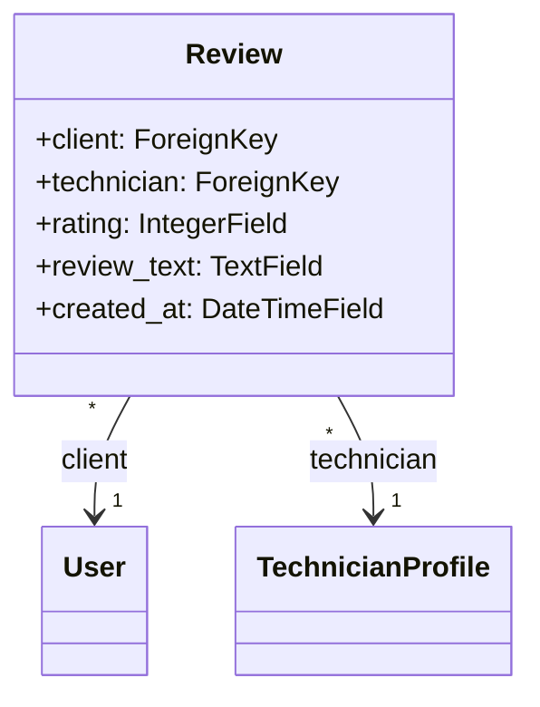
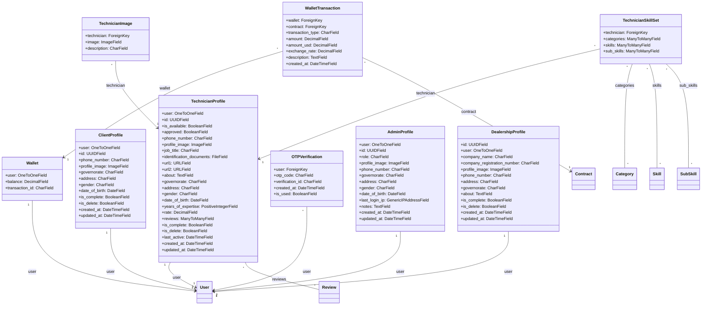
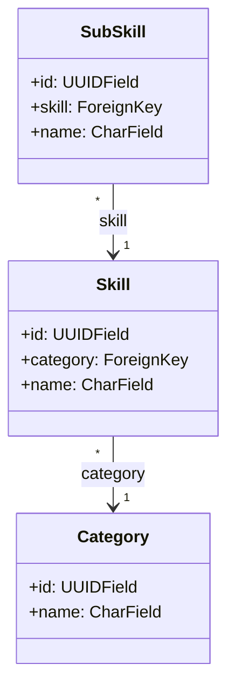
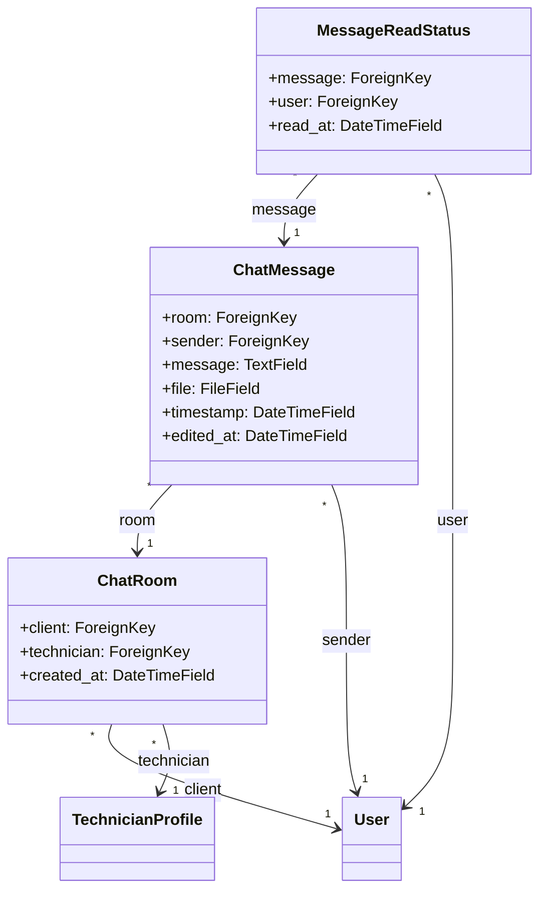
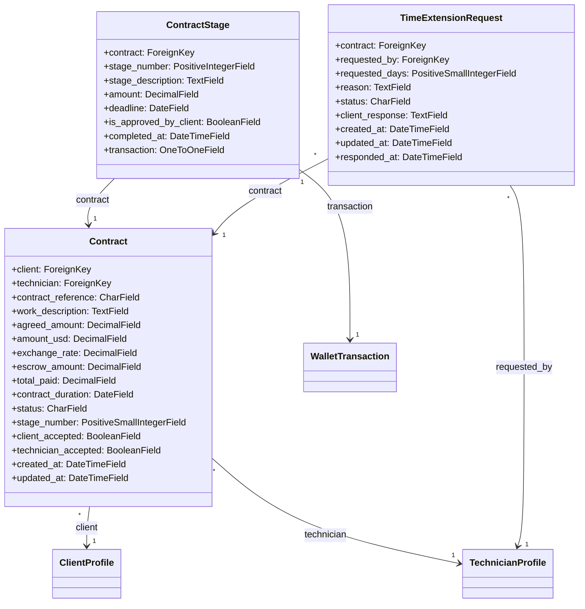
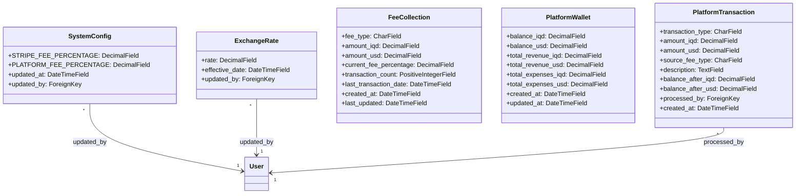
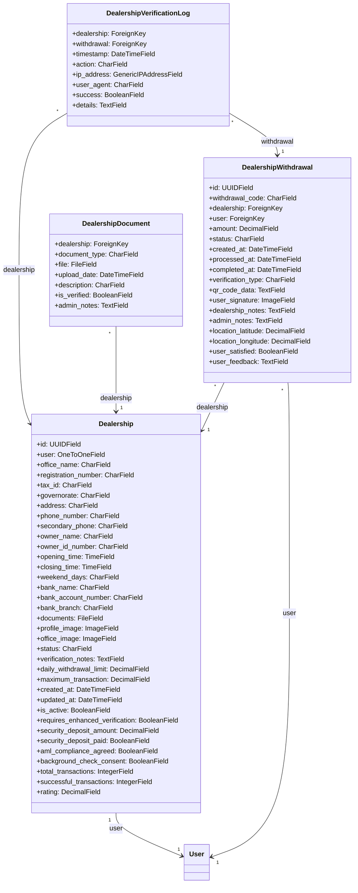
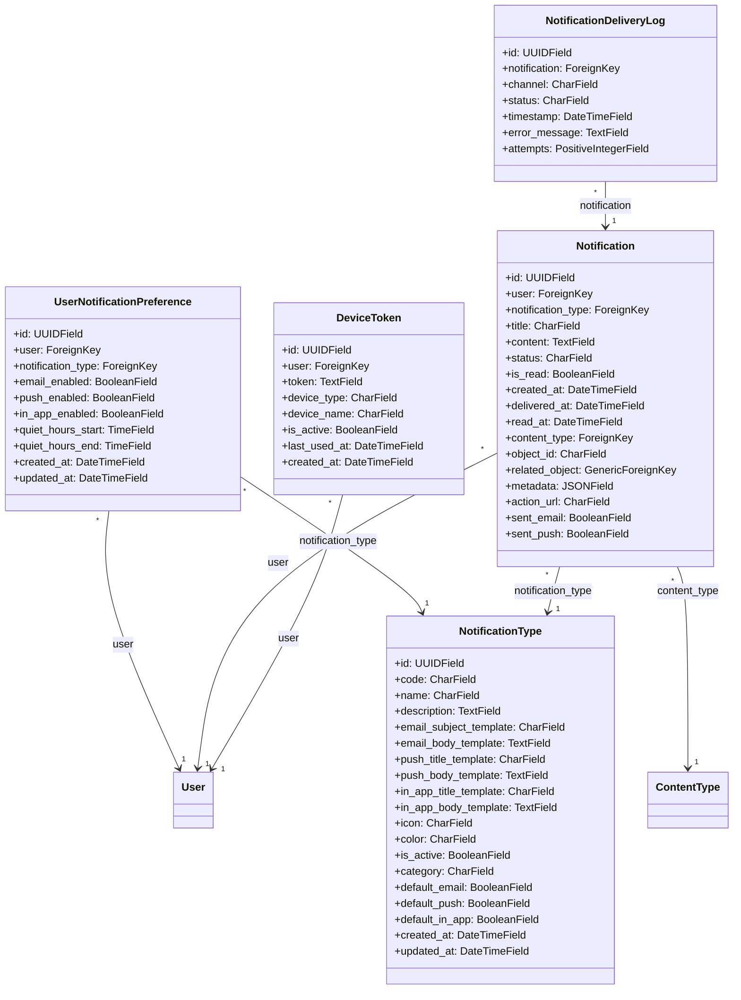

# Tiqani API — Models Diagram (Text)
Generated: 2025-12-27 18:39 UTC
This document summarizes Django models found in the repository and provides Mermaid class diagrams you can render in GitHub/Markdown viewers that support Mermaid.

---

## App: `RateReview`

### App-level diagram

### Model details

#### `Review`

| Field | Type | Key args |
|---|---|---|
| `client` | `ForeignKey` | to=User; on_delete=models.CASCADE; related_name='reviews' |
| `technician` | `ForeignKey` | to=TechnicianProfile; on_delete=models.CASCADE; related_name='reviewed_technicians' |
| `rating` | `IntegerField` | default=0 |
| `review_text` | `TextField` | null; blank |
| `created_at` | `DateTimeField` |  |

**Relationships**

- `client`: `ForeignKey` → `User`, related_name='reviews'
- `technician`: `ForeignKey` → `TechnicianProfile`, related_name='reviewed_technicians'

---

## App: `accounts`

### App-level diagram

### Model details

#### `TechnicianProfile`

| Field | Type | Key args |
|---|---|---|
| `user` | `OneToOneField` | to=User; on_delete=models.CASCADE; related_name='technician_profile' |
| `id` | `UUIDField` | primary_key; default=uuid.uuid4 |
| `is_available` | `BooleanField` | default=True |
| `approved` | `BooleanField` | default=False |
| `phone_number` | `CharField` | null; blank; max_length=11 |
| `profile_image` | `ImageField` | null; blank |
| `job_title` | `CharField` | null; blank; max_length=100 |
| `identification_documents` | `FileField` | null; blank |
| `url1` | `URLField` | null; blank; max_length=255 |
| `url2` | `URLField` | null; blank; max_length=255 |
| `about` | `TextField` | null; blank |
| `governorate` | `CharField` | null; max_length=50 |
| `address` | `CharField` | null; blank; max_length=255 |
| `gender` | `CharField` | null; blank; max_length=6 |
| `date_of_birth` | `DateField` | null; blank |
| `years_of_expertise` | `PositiveIntegerField` | default=0 |
| `rate` | `DecimalField` | default=0.0 |
| `reviews` | `ManyToManyField` | blank; to=Review; related_name='technician_profile_reviews' |
| `is_complete` | `BooleanField` | default=False |
| `is_delete` | `BooleanField` | default=False |
| `last_active` | `DateTimeField` | null; blank |
| `created_at` | `DateTimeField` | default=timezone.now |
| `updated_at` | `DateTimeField` |  |

**Relationships**

- `user`: `OneToOneField` → `User`, related_name='technician_profile'
- `reviews`: `ManyToManyField` → `Review`, related_name='technician_profile_reviews'

#### `TechnicianSkillSet`

| Field | Type | Key args |
|---|---|---|
| `technician` | `ForeignKey` | to=TechnicianProfile; on_delete=models.CASCADE; related_name='skill_sets' |
| `categories` | `ManyToManyField` | to=Category; related_name='technician_skill_sets' |
| `skills` | `ManyToManyField` | to=Skill; related_name='technician_skill_sets' |
| `sub_skills` | `ManyToManyField` | to=SubSkill; related_name='technician_skill_sets' |

**Relationships**

- `technician`: `ForeignKey` → `TechnicianProfile`, related_name='skill_sets'
- `categories`: `ManyToManyField` → `Category`, related_name='technician_skill_sets'
- `skills`: `ManyToManyField` → `Skill`, related_name='technician_skill_sets'
- `sub_skills`: `ManyToManyField` → `SubSkill`, related_name='technician_skill_sets'

#### `TechnicianImage`

| Field | Type | Key args |
|---|---|---|
| `technician` | `ForeignKey` | to=TechnicianProfile; on_delete=models.CASCADE; related_name='images' |
| `image` | `ImageField` |  |
| `description` | `CharField` | null; blank; max_length=255 |

**Relationships**

- `technician`: `ForeignKey` → `TechnicianProfile`, related_name='images'

#### `ClientProfile`

| Field | Type | Key args |
|---|---|---|
| `user` | `OneToOneField` | to=User; on_delete=models.CASCADE; related_name='client_profile' |
| `id` | `UUIDField` | primary_key; default=uuid.uuid4 |
| `phone_number` | `CharField` | null; blank; max_length=11 |
| `profile_image` | `ImageField` | null; blank |
| `governorate` | `CharField` | null; blank; max_length=50 |
| `address` | `CharField` | null; blank; max_length=255 |
| `gender` | `CharField` | null; blank; max_length=6 |
| `date_of_birth` | `DateField` | null; blank |
| `is_complete` | `BooleanField` | default=False |
| `is_delete` | `BooleanField` | default=False |
| `created_at` | `DateTimeField` | default=timezone.now |
| `updated_at` | `DateTimeField` |  |

**Relationships**

- `user`: `OneToOneField` → `User`, related_name='client_profile'

#### `Wallet`

| Field | Type | Key args |
|---|---|---|
| `user` | `OneToOneField` | to=User; on_delete=models.CASCADE; related_name='wallet' |
| `balance` | `DecimalField` | default=0.0 |
| `transaction_id` | `CharField` | unique; max_length=12 |

**Relationships**

- `user`: `OneToOneField` → `User`, related_name='wallet'

#### `WalletTransaction`

| Field | Type | Key args |
|---|---|---|
| `wallet` | `ForeignKey` | to=Wallet; on_delete=models.CASCADE; related_name='transactions' |
| `contract` | `ForeignKey` | null; blank; to=Contract; on_delete=models.CASCADE; related_name='transactions' |
| `transaction_type` | `CharField` | max_length=20 |
| `amount` | `DecimalField` |  |
| `amount_usd` | `DecimalField` | null; blank |
| `exchange_rate` | `DecimalField` | null; blank |
| `description` | `TextField` |  |
| `created_at` | `DateTimeField` |  |

**Relationships**

- `wallet`: `ForeignKey` → `Wallet`, related_name='transactions'
- `contract`: `ForeignKey` → `Contract`, related_name='transactions'

#### `OTPVerification`

| Field | Type | Key args |
|---|---|---|
| `user` | `ForeignKey` | to=User; on_delete=models.CASCADE; related_name='otp_codes' |
| `otp_code` | `CharField` | max_length=6 |
| `verification_id` | `CharField` | unique; max_length=32 |
| `created_at` | `DateTimeField` |  |
| `is_used` | `BooleanField` | default=False |

**Relationships**

- `user`: `ForeignKey` → `User`, related_name='otp_codes'

#### `AdminProfile`

| Field | Type | Key args |
|---|---|---|
| `user` | `OneToOneField` | to=User; on_delete=models.CASCADE; related_name='admin_profile' |
| `id` | `UUIDField` | primary_key; default=uuid.uuid4 |
| `role` | `CharField` | max_length=50; default='system_admin' |
| `profile_image` | `ImageField` | null; blank |
| `phone_number` | `CharField` | null; blank; max_length=11 |
| `governorate` | `CharField` | null; blank; max_length=50 |
| `address` | `CharField` | null; blank; max_length=255 |
| `gender` | `CharField` | null; blank; max_length=6 |
| `date_of_birth` | `DateField` | null; blank |
| `last_login_ip` | `GenericIPAddressField` | null; blank |
| `notes` | `TextField` | null; blank |
| `created_at` | `DateTimeField` |  |
| `updated_at` | `DateTimeField` |  |

**Relationships**

- `user`: `OneToOneField` → `User`, related_name='admin_profile'

#### `DealershipProfile`

| Field | Type | Key args |
|---|---|---|
| `id` | `UUIDField` | primary_key; default=uuid.uuid4 |
| `user` | `OneToOneField` | to=User; on_delete=models.CASCADE; related_name='dealership_profile' |
| `company_name` | `CharField` | max_length=255 |
| `company_registration_number` | `CharField` | unique; max_length=50 |
| `profile_image` | `ImageField` | null; blank |
| `phone_number` | `CharField` | max_length=15 |
| `address` | `CharField` | max_length=255 |
| `governorate` | `CharField` | max_length=50 |
| `about` | `TextField` | blank |
| `is_complete` | `BooleanField` | default=False |
| `is_delete` | `BooleanField` | default=False |
| `created_at` | `DateTimeField` |  |
| `updated_at` | `DateTimeField` |  |

**Relationships**

- `user`: `OneToOneField` → `User`, related_name='dealership_profile'

---

## App: `category`

### App-level diagram

### Model details

#### `Category`

| Field | Type | Key args |
|---|---|---|
| `id` | `UUIDField` | primary_key; default=uuid.uuid4 |
| `name` | `CharField` | unique; max_length=255 |

#### `Skill`

| Field | Type | Key args |
|---|---|---|
| `id` | `UUIDField` | primary_key; default=uuid.uuid4 |
| `category` | `ForeignKey` | to=Category; on_delete=models.CASCADE; related_name='skills' |
| `name` | `CharField` | max_length=255 |

**Relationships**

- `category`: `ForeignKey` → `Category`, related_name='skills'

#### `SubSkill`

| Field | Type | Key args |
|---|---|---|
| `id` | `UUIDField` | primary_key; default=uuid.uuid4 |
| `skill` | `ForeignKey` | to=Skill; on_delete=models.CASCADE; related_name='sub_skills' |
| `name` | `CharField` | max_length=255 |

**Relationships**

- `skill`: `ForeignKey` → `Skill`, related_name='sub_skills'

---

## App: `chat`

### App-level diagram

### Model details

#### `ChatRoom`

| Field | Type | Key args |
|---|---|---|
| `client` | `ForeignKey` | to=User; on_delete=models.CASCADE; related_name='client_rooms' |
| `technician` | `ForeignKey` | to=TechnicianProfile; on_delete=models.CASCADE; related_name='technician_rooms' |
| `created_at` | `DateTimeField` |  |

**Relationships**

- `client`: `ForeignKey` → `User`, related_name='client_rooms'
- `technician`: `ForeignKey` → `TechnicianProfile`, related_name='technician_rooms'

#### `ChatMessage`

| Field | Type | Key args |
|---|---|---|
| `room` | `ForeignKey` | to=ChatRoom; on_delete=models.CASCADE; related_name='messages' |
| `sender` | `ForeignKey` | to=User; on_delete=models.CASCADE |
| `message` | `TextField` | null; blank; max_length=1000 |
| `file` | `FileField` | null; blank |
| `timestamp` | `DateTimeField` |  |
| `edited_at` | `DateTimeField` | null; blank |

**Relationships**

- `room`: `ForeignKey` → `ChatRoom`, related_name='messages'
- `sender`: `ForeignKey` → `User`

#### `MessageReadStatus`

| Field | Type | Key args |
|---|---|---|
| `message` | `ForeignKey` | to=ChatMessage; on_delete=models.CASCADE; related_name='read_status' |
| `user` | `ForeignKey` | to=User; on_delete=models.CASCADE |
| `read_at` | `DateTimeField` |  |

**Relationships**

- `message`: `ForeignKey` → `ChatMessage`, related_name='read_status'
- `user`: `ForeignKey` → `User`

**Meta**

- `unique_together` = `('message', 'user')`
- `indexes` = `[models.Index(fields=['message', 'user']), models.Index(fields=['user', 'read_at'])]`

---

## App: `contract`

### App-level diagram

### Model details

#### `Contract`

| Field | Type | Key args |
|---|---|---|
| `client` | `ForeignKey` | to=ClientProfile; on_delete=models.CASCADE; related_name='contracts' |
| `technician` | `ForeignKey` | to=TechnicianProfile; on_delete=models.CASCADE; related_name='contracts' |
| `contract_reference` | `CharField` | unique; blank; max_length=20 |
| `work_description` | `TextField` |  |
| `agreed_amount` | `DecimalField` | null; blank |
| `amount_usd` | `DecimalField` | null; blank |
| `exchange_rate` | `DecimalField` | null; blank |
| `escrow_amount` | `DecimalField` | default=0 |
| `total_paid` | `DecimalField` | default=0 |
| `contract_duration` | `DateField` |  |
| `status` | `CharField` | max_length=50; default='draft' |
| `stage_number` | `PositiveSmallIntegerField` | null; blank |
| `client_accepted` | `BooleanField` | default=False |
| `technician_accepted` | `BooleanField` | default=False |
| `created_at` | `DateTimeField` |  |
| `updated_at` | `DateTimeField` |  |

**Relationships**

- `client`: `ForeignKey` → `ClientProfile`, related_name='contracts'
- `technician`: `ForeignKey` → `TechnicianProfile`, related_name='contracts'

#### `ContractStage`

| Field | Type | Key args |
|---|---|---|
| `contract` | `ForeignKey` | to=Contract; on_delete=models.CASCADE; related_name='stages' |
| `stage_number` | `PositiveIntegerField` |  |
| `stage_description` | `TextField` |  |
| `amount` | `DecimalField` |  |
| `deadline` | `DateField` |  |
| `is_approved_by_client` | `BooleanField` | default=False |
| `completed_at` | `DateTimeField` | null; blank |
| `transaction` | `OneToOneField` | null; blank; to=WalletTransaction; on_delete=models.SET_NULL |

**Relationships**

- `contract`: `ForeignKey` → `Contract`, related_name='stages'
- `transaction`: `OneToOneField` → `WalletTransaction`

#### `TimeExtensionRequest`

| Field | Type | Key args |
|---|---|---|
| `contract` | `ForeignKey` | to=Contract; on_delete=models.CASCADE; related_name='extension_requests' |
| `requested_by` | `ForeignKey` | to=TechnicianProfile; on_delete=models.CASCADE; related_name='extension_requests' |
| `requested_days` | `PositiveSmallIntegerField` |  |
| `reason` | `TextField` |  |
| `status` | `CharField` | max_length=20; default='pending' |
| `client_response` | `TextField` | null; blank |
| `created_at` | `DateTimeField` |  |
| `updated_at` | `DateTimeField` |  |
| `responded_at` | `DateTimeField` | null; blank |

**Relationships**

- `contract`: `ForeignKey` → `Contract`, related_name='extension_requests'
- `requested_by`: `ForeignKey` → `TechnicianProfile`, related_name='extension_requests'

**Meta**

- `ordering` = `['-created_at']`

---

## App: `dashboard`

### App-level diagram

### Model details

#### `SystemConfig`

| Field | Type | Key args |
|---|---|---|
| `STRIPE_FEE_PERCENTAGE` | `DecimalField` | default=5.0 |
| `PLATFORM_FEE_PERCENTAGE` | `DecimalField` | default=10.0 |
| `updated_at` | `DateTimeField` |  |
| `updated_by` | `ForeignKey` | null; blank; to=User; on_delete=models.SET_NULL |

**Relationships**

- `updated_by`: `ForeignKey` → `User`

**Meta**

- `verbose_name` = `'System Configuration'`
- `verbose_name_plural` = `'System Configurations'`

#### `ExchangeRate`

| Field | Type | Key args |
|---|---|---|
| `rate` | `DecimalField` |  |
| `effective_date` | `DateTimeField` |  |
| `updated_by` | `ForeignKey` | null; blank; to=User; on_delete=models.SET_NULL |

**Relationships**

- `updated_by`: `ForeignKey` → `User`

**Meta**

- `ordering` = `['-effective_date']`
- `verbose_name` = `'Exchange Rate'`
- `verbose_name_plural` = `'Exchange Rates'`

#### `FeeCollection`

| Field | Type | Key args |
|---|---|---|
| `fee_type` | `CharField` | unique; max_length=20 |
| `amount_iqd` | `DecimalField` | default=0.0 |
| `amount_usd` | `DecimalField` | default=0.0 |
| `current_fee_percentage` | `DecimalField` |  |
| `transaction_count` | `PositiveIntegerField` | default=0 |
| `last_transaction_date` | `DateTimeField` | null; blank |
| `created_at` | `DateTimeField` |  |
| `last_updated` | `DateTimeField` |  |

**Meta**

- `verbose_name` = `'Fee Collection'`
- `verbose_name_plural` = `'Fee Collections'`
- `ordering` = `['fee_type']`

#### `PlatformWallet`

| Field | Type | Key args |
|---|---|---|
| `balance_iqd` | `DecimalField` | default=0.0 |
| `balance_usd` | `DecimalField` | default=0.0 |
| `total_revenue_iqd` | `DecimalField` | default=0.0 |
| `total_revenue_usd` | `DecimalField` | default=0.0 |
| `total_expenses_iqd` | `DecimalField` | default=0.0 |
| `total_expenses_usd` | `DecimalField` | default=0.0 |
| `created_at` | `DateTimeField` |  |
| `updated_at` | `DateTimeField` |  |

**Meta**

- `verbose_name` = `'Platform Wallet'`
- `verbose_name_plural` = `'Platform Wallet'`

#### `PlatformTransaction`

| Field | Type | Key args |
|---|---|---|
| `transaction_type` | `CharField` | max_length=20 |
| `amount_iqd` | `DecimalField` |  |
| `amount_usd` | `DecimalField` |  |
| `source_fee_type` | `CharField` | null; blank; max_length=20 |
| `description` | `TextField` |  |
| `balance_after_iqd` | `DecimalField` |  |
| `balance_after_usd` | `DecimalField` |  |
| `processed_by` | `ForeignKey` | null; blank; to=User; on_delete=models.SET_NULL |
| `created_at` | `DateTimeField` |  |

**Relationships**

- `processed_by`: `ForeignKey` → `User`

**Meta**

- `ordering` = `['-created_at']`
- `verbose_name` = `'Platform Transaction'`
- `verbose_name_plural` = `'Platform Transactions'`

---

## App: `dealership`

### App-level diagram

### Model details

#### `Dealership`

| Field | Type | Key args |
|---|---|---|
| `id` | `UUIDField` | primary_key; default=uuid.uuid4 |
| `user` | `OneToOneField` | to=User; on_delete=models.CASCADE; related_name='dealership' |
| `office_name` | `CharField` | max_length=255 |
| `registration_number` | `CharField` | unique; max_length=50 |
| `tax_id` | `CharField` | unique; max_length=50 |
| `governorate` | `CharField` | max_length=50 |
| `address` | `CharField` | max_length=255 |
| `phone_number` | `CharField` | max_length=11 |
| `secondary_phone` | `CharField` | null; blank; max_length=11 |
| `owner_name` | `CharField` | max_length=255 |
| `owner_id_number` | `CharField` | max_length=50 |
| `opening_time` | `TimeField` |  |
| `closing_time` | `TimeField` |  |
| `weekend_days` | `CharField` | blank; max_length=100 |
| `bank_name` | `CharField` | null; blank; max_length=255 |
| `bank_account_number` | `CharField` | null; blank; max_length=50 |
| `bank_branch` | `CharField` | null; blank; max_length=100 |
| `documents` | `FileField` |  |
| `profile_image` | `ImageField` | null; blank |
| `office_image` | `ImageField` | null; blank |
| `status` | `CharField` | max_length=20; default='pending' |
| `verification_notes` | `TextField` | blank |
| `daily_withdrawal_limit` | `DecimalField` | default=5000000.0 |
| `maximum_transaction` | `DecimalField` | default=1000000.0 |
| `created_at` | `DateTimeField` |  |
| `updated_at` | `DateTimeField` |  |
| `is_active` | `BooleanField` | default=False |
| `requires_enhanced_verification` | `BooleanField` | default=False |
| `security_deposit_amount` | `DecimalField` | default=0.0 |
| `security_deposit_paid` | `BooleanField` | default=False |
| `aml_compliance_agreed` | `BooleanField` | default=False |
| `background_check_consent` | `BooleanField` | default=False |
| `total_transactions` | `IntegerField` | default=0 |
| `successful_transactions` | `IntegerField` | default=0 |
| `rating` | `DecimalField` | default=0.0 |

**Relationships**

- `user`: `OneToOneField` → `User`, related_name='dealership'

**Meta**

- `verbose_name` = `'Dealership'`
- `verbose_name_plural` = `'Dealerships'`
- `ordering` = `['-created_at']`

#### `DealershipWithdrawal`

| Field | Type | Key args |
|---|---|---|
| `id` | `UUIDField` | primary_key; default=uuid.uuid4 |
| `withdrawal_code` | `CharField` | unique; max_length=12 |
| `dealership` | `ForeignKey` | to=Dealership; on_delete=models.CASCADE; related_name='withdrawals' |
| `user` | `ForeignKey` | to=User; on_delete=models.CASCADE; related_name='dealership_withdrawals' |
| `amount` | `DecimalField` |  |
| `status` | `CharField` | max_length=20; default='pending' |
| `created_at` | `DateTimeField` |  |
| `processed_at` | `DateTimeField` | null; blank |
| `completed_at` | `DateTimeField` | null; blank |
| `verification_type` | `CharField` | max_length=20; default='standard' |
| `qr_code_data` | `TextField` | blank |
| `user_signature` | `ImageField` | null; blank |
| `dealership_notes` | `TextField` | blank |
| `admin_notes` | `TextField` | blank |
| `location_latitude` | `DecimalField` | null; blank |
| `location_longitude` | `DecimalField` | null; blank |
| `user_satisfied` | `BooleanField` | null; blank |
| `user_feedback` | `TextField` | blank |

**Relationships**

- `dealership`: `ForeignKey` → `Dealership`, related_name='withdrawals'
- `user`: `ForeignKey` → `User`, related_name='dealership_withdrawals'

**Meta**

- `verbose_name` = `'Withdrawal'`
- `verbose_name_plural` = `'Withdrawals'`
- `ordering` = `['-created_at']`

#### `DealershipVerificationLog`

| Field | Type | Key args |
|---|---|---|
| `dealership` | `ForeignKey` | to=Dealership; on_delete=models.CASCADE; related_name='verification_logs' |
| `withdrawal` | `ForeignKey` | null; blank; to=DealershipWithdrawal; on_delete=models.CASCADE; related_name='verification_logs' |
| `timestamp` | `DateTimeField` |  |
| `action` | `CharField` | max_length=100 |
| `ip_address` | `GenericIPAddressField` | null; blank |
| `user_agent` | `CharField` | blank; max_length=500 |
| `success` | `BooleanField` | default=True |
| `details` | `TextField` | blank |

**Relationships**

- `dealership`: `ForeignKey` → `Dealership`, related_name='verification_logs'
- `withdrawal`: `ForeignKey` → `DealershipWithdrawal`, related_name='verification_logs'

**Meta**

- `verbose_name` = `'Verification Log'`
- `verbose_name_plural` = `'Verification Logs'`
- `ordering` = `['-timestamp']`

#### `DealershipDocument`

| Field | Type | Key args |
|---|---|---|
| `dealership` | `ForeignKey` | to=Dealership; on_delete=models.CASCADE; related_name='individual_documents' |
| `document_type` | `CharField` | max_length=50 |
| `file` | `FileField` |  |
| `upload_date` | `DateTimeField` |  |
| `description` | `CharField` | blank; max_length=255 |
| `is_verified` | `BooleanField` | default=False |
| `admin_notes` | `TextField` | blank |

**Relationships**

- `dealership`: `ForeignKey` → `Dealership`, related_name='individual_documents'

**Meta**

- `verbose_name` = `'Document'`
- `verbose_name_plural` = `'Documents'`
- `ordering` = `['-upload_date']`

---

## App: `notification`

### App-level diagram

### Model details

#### `NotificationType`

| Field | Type | Key args |
|---|---|---|
| `id` | `UUIDField` | primary_key; default=uuid.uuid4 |
| `code` | `CharField` | unique; max_length=100 |
| `name` | `CharField` | max_length=255 |
| `description` | `TextField` | blank |
| `email_subject_template` | `CharField` | blank; max_length=255 |
| `email_body_template` | `TextField` | blank |
| `push_title_template` | `CharField` | blank; max_length=255 |
| `push_body_template` | `TextField` | blank |
| `in_app_title_template` | `CharField` | blank; max_length=255 |
| `in_app_body_template` | `TextField` | blank |
| `icon` | `CharField` | blank; max_length=50 |
| `color` | `CharField` | blank; max_length=20 |
| `is_active` | `BooleanField` | default=True |
| `category` | `CharField` | max_length=50; default='general' |
| `default_email` | `BooleanField` | default=True |
| `default_push` | `BooleanField` | default=True |
| `default_in_app` | `BooleanField` | default=True |
| `created_at` | `DateTimeField` |  |
| `updated_at` | `DateTimeField` |  |

**Meta**

- `verbose_name` = `'Notification Type'`
- `verbose_name_plural` = `'Notification Types'`
- `ordering` = `['category', 'name']`

#### `UserNotificationPreference`

| Field | Type | Key args |
|---|---|---|
| `id` | `UUIDField` | primary_key; default=uuid.uuid4 |
| `user` | `ForeignKey` | to=User; on_delete=models.CASCADE; related_name='notification_preferences' |
| `notification_type` | `ForeignKey` | to=NotificationType; on_delete=models.CASCADE; related_name='user_preferences' |
| `email_enabled` | `BooleanField` | default=True |
| `push_enabled` | `BooleanField` | default=True |
| `in_app_enabled` | `BooleanField` | default=True |
| `quiet_hours_start` | `TimeField` | null; blank |
| `quiet_hours_end` | `TimeField` | null; blank |
| `created_at` | `DateTimeField` |  |
| `updated_at` | `DateTimeField` |  |

**Relationships**

- `user`: `ForeignKey` → `User`, related_name='notification_preferences'
- `notification_type`: `ForeignKey` → `NotificationType`, related_name='user_preferences'

**Meta**

- `verbose_name` = `'User Notification Preference'`
- `verbose_name_plural` = `'User Notification Preferences'`
- `unique_together` = `['user', 'notification_type']`

#### `Notification`

| Field | Type | Key args |
|---|---|---|
| `id` | `UUIDField` | primary_key; default=uuid.uuid4 |
| `user` | `ForeignKey` | to=User; on_delete=models.CASCADE; related_name='notifications' |
| `notification_type` | `ForeignKey` | null; to=NotificationType; on_delete=models.SET_NULL; related_name='notifications' |
| `title` | `CharField` | max_length=255 |
| `content` | `TextField` |  |
| `status` | `CharField` | max_length=20; default='pending' |
| `is_read` | `BooleanField` | default=False |
| `created_at` | `DateTimeField` |  |
| `delivered_at` | `DateTimeField` | null; blank |
| `read_at` | `DateTimeField` | null; blank |
| `content_type` | `ForeignKey` | null; blank; to=ContentType; on_delete=models.CASCADE |
| `object_id` | `CharField` | null; blank; max_length=50 |
| `related_object` | `GenericForeignKey` |  |
| `metadata` | `JSONField` | null; blank |
| `action_url` | `CharField` | blank; max_length=255 |
| `sent_email` | `BooleanField` | default=False |
| `sent_push` | `BooleanField` | default=False |

**Relationships**

- `user`: `ForeignKey` → `User`, related_name='notifications'
- `notification_type`: `ForeignKey` → `NotificationType`, related_name='notifications'
- `content_type`: `ForeignKey` → `ContentType`

**Meta**

- `verbose_name` = `'Notification'`
- `verbose_name_plural` = `'Notifications'`
- `ordering` = `['-created_at']`

#### `NotificationDeliveryLog`

| Field | Type | Key args |
|---|---|---|
| `id` | `UUIDField` | primary_key; default=uuid.uuid4 |
| `notification` | `ForeignKey` | to=Notification; on_delete=models.CASCADE; related_name='delivery_logs' |
| `channel` | `CharField` | max_length=20 |
| `status` | `CharField` | max_length=20 |
| `timestamp` | `DateTimeField` |  |
| `error_message` | `TextField` | blank |
| `attempts` | `PositiveIntegerField` | default=1 |

**Relationships**

- `notification`: `ForeignKey` → `Notification`, related_name='delivery_logs'

**Meta**

- `verbose_name` = `'Notification Delivery Log'`
- `verbose_name_plural` = `'Notification Delivery Logs'`
- `ordering` = `['-timestamp']`

#### `DeviceToken`

| Field | Type | Key args |
|---|---|---|
| `id` | `UUIDField` | primary_key; default=uuid.uuid4 |
| `user` | `ForeignKey` | to=User; on_delete=models.CASCADE; related_name='device_tokens' |
| `token` | `TextField` |  |
| `device_type` | `CharField` | max_length=10 |
| `device_name` | `CharField` | blank; max_length=255 |
| `is_active` | `BooleanField` | default=True |
| `last_used_at` | `DateTimeField` |  |
| `created_at` | `DateTimeField` |  |

**Relationships**

- `user`: `ForeignKey` → `User`, related_name='device_tokens'

**Meta**

- `verbose_name` = `'Device Token'`
- `verbose_name_plural` = `'Device Tokens'`
- `unique_together` = `['user', 'token']`

---

## App: `payment`
_No Django models detected in this app’s `models.py`._
